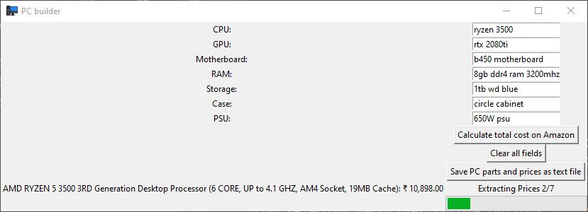

# PCbudgeter
Instead of performing the tedious task of searching all your PC components for your new gaming PC, this program basically does it for you automatically by just taking all the names of the PC components you want and gives you the total budget.

Uses Tkinter and Selenium.

A lot of libraries are being used right now. Make sure to install all the required libraries in order to run the program properly.

Features Currently:
Calculate Price on Amazon just by clicking a single button.

Notification when completed.

Store all the names of PC parts and prices as a notepad file. 

Upcoming Features:
To store parts and prices as excel file.
